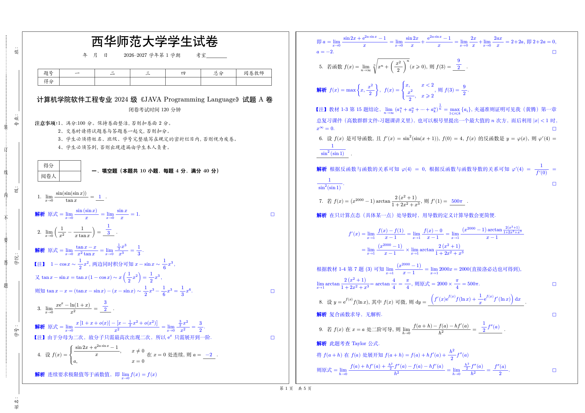
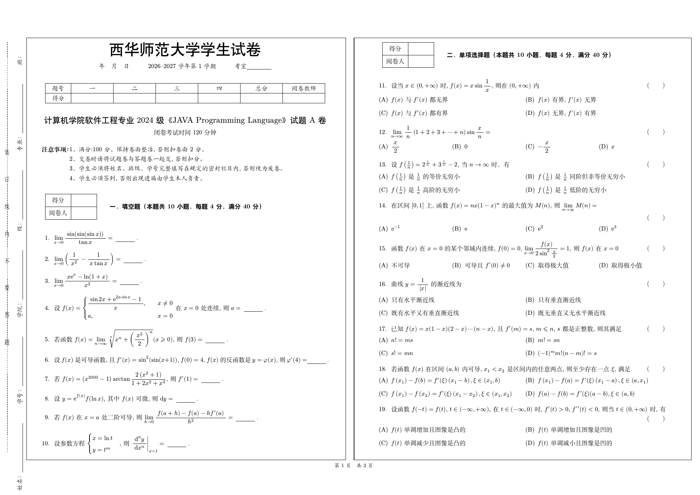
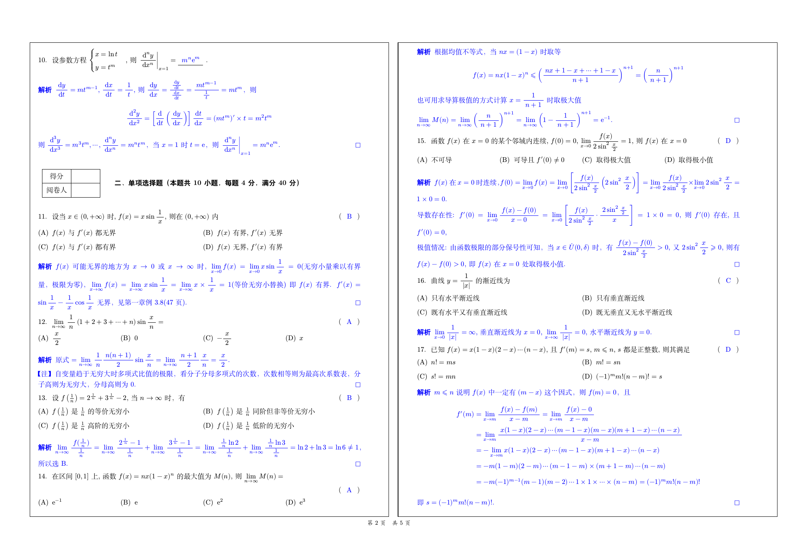
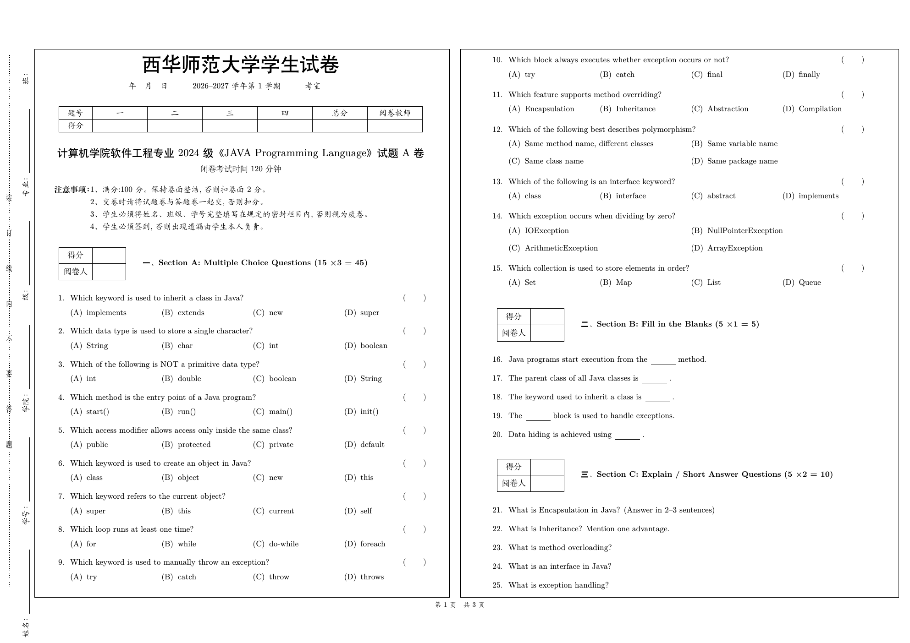
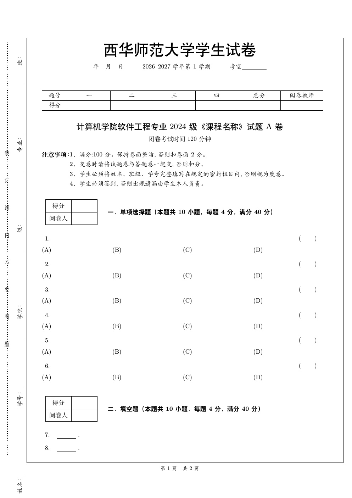

# 西华师范大学试卷 LaTeX 模板

这是一个面向西华师范大学课程考试试卷的 LaTeX 模板，基于
[`exam-zh`](https://gitee.com/xkwxdyy/exam-zh) 定制。模板处理学校试卷表头、密封线、计分表、页眉页脚、答案显示/隐藏和常用数学排版命令，让出卷时主要关注题目内容。

## 效果预览

教师解析版 | 学生作答版
:---:|:---:
 | 

示例试卷第二页 | Java 课程示例
:---:|:---:
 | 

空白模板第一页：



## 环境要求

必须使用 XeLaTeX。不要使用 `pdflatex`，否则中文、字体和 `exam-zh` 相关功能很容易失败。

建议环境：

- TeX Live 2024+、MacTeX 2024+ 或 MiKTeX 最新版。
- `latexmk`，用于多次编译和自动处理交叉引用。
- `exam-zh`、`ctex`、`xeCJK`、`unicode-math`、`tikz`、`tabularx`、`makecell`、`zref`、`lastpage` 等宏包。
- 可选：`latexindent`，只在格式化源码时需要，编译试卷不需要。
- 可选：`poppler`，只在从 PDF 导出预览图时需要，例如 `pdftoppm`。

如果遇到 `File 'exam-zh.cls' not found` 或类似错误，说明当前 TeX 发行版不完整或太旧。优先安装完整 TeX 发行版，或用发行版自带的包管理器更新宏包。

## 快速开始

复制 `template/demo.tex`，或直接参考 `examples/demo.tex`。新试卷至少需要：

```tex
\documentclass{CWNUExam}

\cwnuexamsetup{
  pdf = {
    title    = {课程期末考试试卷A卷},
    author   = {西华师范大学},
    subject  = {课程考试},
    keywords = {西华师范大学; 试卷; LaTeX},
  },
  title = {
    year       = {2026},
    semester   = {1},
    course     = {课程名称},
    suffix     = {期末},
    type       = {A},
    total-part = {4},
    college    = {计算机学院},
    major      = {软件工程专业},
    grade      = {2024级},
    exam-type  = {闭卷},
    exam-time  = {120},
    exam-category = {考试},
    test-type  = {normal},
  },
}

\examsetup{page/size = a3paper}

\begin{document}
\maketitle

\section{单项选择题（本题共10小题，每题4分，满分40分）}

\begin{question}
题干内容
\paren[A]
\begin{choices}
  \item 选项 A
  \item 选项 B
  \item 选项 C
  \item 选项 D
\end{choices}
\end{question}

\begin{analysis}
解析内容。
\end{analysis}

\end{document}
```

在仓库根目录编译：

```bash
latexmk -xelatex examples/demo.tex
```

默认输出目录由 `.latexmkrc` 控制：

- PDF：`build/pdf/`
- 辅助文件：`build/aux/`

这样 `.aux`、`.log`、`.xdv`、`.out`、`.fls`、`.fdb_latexmk` 等文件不会直接写到仓库根目录。

## 生成学生版

默认示例会显示答案和解析，适合教师版或解析版。生成隐藏答案的学生版：

```bash
latexmk -xelatex -pretex='\AddToHook{env/document/before}{\ExamPrintAnswer}' -usepretex -jobname=demo_student_version examples/demo.tex
```

Windows PowerShell 中如果单引号转义不符合预期，可以改用双引号：

```powershell
latexmk -xelatex -pretex="\AddToHook{env/document/before}{\ExamPrintAnswer}" -usepretex -jobname=demo_student_version examples/demo.tex
```

不要默认加 `-shell-escape`。本项目正常编译不需要 shell escape，开启后可能触发上游包的额外自动构建逻辑，反而让输出难以控制。

## 不同系统使用

### Windows

推荐安装 TeX Live 或 MiKTeX。MiKTeX 用户需要允许自动安装缺失宏包，或提前安装完整宏包集。

在 PowerShell 或命令提示符中进入仓库根目录后运行：

```powershell
latexmk -xelatex examples/demo.tex
```

也可以双击或运行根目录的 `Make.bat`。它会格式化示例源码并编译 `examples/demo.tex`。如果只想编译，不想格式化，直接用 `latexmk` 命令更稳妥。

### macOS

推荐安装 MacTeX。安装后确认终端能找到 TeX 工具：

```bash
which xelatex
which latexmk
```

如果命令不存在，把 `/Library/TeX/texbin` 加到 `PATH`，或重新打开终端后再试。编译命令：

```bash
latexmk -xelatex examples/demo.tex
```

### Linux

推荐安装完整 TeX Live。不同发行版包名不同，核心要求是包含 `xelatex`、`latexmk`、中文支持、`exam-zh` 和常用数学/绘图宏包。

编译命令：

```bash
latexmk -xelatex examples/demo.tex
```

如果只安装了最小 TeX 环境，缺包会比较频繁。为了减少跨电脑问题，发布或移交前建议在另一台机器上至少编译一次 `examples/demo.tex` 和自己的试卷。

## Overleaf 使用

Overleaf 中建议新建一个空白项目，然后上传或创建这些文件：

- `CWNUExam.cls`
- 你的主试卷文件，例如把 `template/demo.tex` 的内容复制为 `main.tex`
- 如果要参考示例，也可以上传 `examples/` 中的 `.tex` 文件
- 如需 README 里的预览图，再上传 `img/`，但编译试卷本身不依赖这些图片

在 Overleaf 菜单中设置：

- Compiler：`XeLaTeX`
- TeX Live：选择可用的最新版本
- Main document：选择你的主试卷文件，例如 `main.tex`

注意事项：

- Overleaf 不需要保留本仓库的 `build/` 目录，输出由 Overleaf 管理。
- 如果 Overleaf 报缺少 `exam-zh`，先切换到最新 TeX Live；仍然缺失时，需要上传缺失的上游类/宏包文件，或改用本地完整 TeX Live 编译。
- 不要把示例文件里的课程名、学院、专业、年级、考试方式和考试时间原样发布，先按真实试卷信息修改。

## 主要配置

使用 `\cwnuexamsetup{...}` 配置模板。

### `pdf`

| 字段 | 说明 |
| --- | --- |
| `title` | PDF 标题 |
| `author` | PDF 作者 |
| `subject` | PDF 主题 |
| `keywords` | PDF 关键词 |

### `title`

| 字段 | 说明 |
| --- | --- |
| `year` | 学年起始年份，例如 `2026` 会显示 `2026--2027` 学年 |
| `semester` | 学期 |
| `course` | 课程名称 |
| `suffix` | 试卷类型前缀，如 `期中`、`期末` |
| `type` | A/B/模拟等卷别 |
| `total-part` | 计分表中的大题数量 |
| `college` | 学院 |
| `major` | 专业 |
| `grade` | 年级 |
| `exam-room` | 考室 |
| `exam-type` | `闭卷` 或 `开卷` |
| `exam-time` | 考试时间，单位分钟 |
| `exam-category` | `考试` 或 `考查` |
| `test-type` | `normal` 为中文注意事项，`international` 为英文注意事项 |

## 常用命令和环境

- `\begin{question}...\end{question}`：客观题。
- `\begin{problem}...\end{problem}`：主观题。
- `\paren[A]`：选择题答案。
- `\fillin[答案]`：填空题答案。
- `\begin{analysis}...\end{analysis}`：解析。
- `\begin{solution}...\end{solution}`：解答。
- `\begin{proof}...\end{proof}`：证明。
- `\makeCover` / `\makeBackCover`：封面和封底，可按需使用。

更多题型、答案控制和排版参数请参考 `exam-zh` 上游文档。

## 仓库文件

- `CWNUExam.cls`：主模板类。
- `template/demo.tex`：空白试卷模板，适合复制后开始新试卷。
- `examples/demo.tex`：较完整的中文示例。
- `examples/JavaTestPaperA.tex`、`examples/JavaTestPaperB.tex`：Java 课程示例。
- `examples/ProbabilityTestA.tex`、`examples/ProbabilityTestB.tex`：概率统计课程示例。
- `img/`：README 预览图。
- `.latexmkrc`：XeLaTeX 编译配置，默认将生成文件写入 `build/`。
- `Make.bat`：Windows 下的示例构建脚本。
- `latexindent.yaml`：LaTeX 格式化配置。

## 清理和维护

清理辅助文件：

```bash
latexmk -c
```

清理所有由 `latexmk` 生成的目标文件：

```bash
latexmk -C
```

`build/` 已加入 `.gitignore`，正常不要提交。发布模板时建议提交 `.tex`、`.cls`、`.latexmkrc`、README、示例图片和脚本，不提交编译产生的 PDF、aux、log、xdv、synctex 等文件。

## 从 Mathpix 导出的代码整理

下面是整理题目录入时常用的正则替换规则，替换后仍需要人工校对答案、题型和数学符号。

| 查找 | 替换 | 作用 |
| --- | --- | --- |
| `*\([A]+\) *(.+) *\n` | `\\options{$1}%\n` | 提取 A 选项 |
| `*\([B-D]+\) *(.+) *\n` | `{$1}%\n` | 提取 B/C/D 选项 |
| `*\\mathrm\{~?([d])\} *` | `\\dif` | 正体 d |
| `*\\mathrm\{~?([e])\} *` | `\\upe` | 正体 e |
| `\\begin\{enumerate\}` | 空 | 去除 `enumerate` 环境 |
| `\\end\{enumerate\}` | 空 | 去除 `enumerate` 环境 |
| `\\item *([\s\S\n]+?\.?)$\n\n` | `\\begin{question}\n$1\n\\end{question}\n\n\\begin{analysis}\n\n\\end{analysis}\n\n` | 提取题目并加入解析环境 |
| `\\options\{(.+)\}%?\n *\{(.+)\}%?\n *\{(.+)\}%?\n *\{(.+)\}%?` | `\\begin{choices}\n  \\item $1\n  \\item $2\n  \\item $3\n  \\item $4\n\\end{choices}` | 转换选择题选项 |

人工处理要点：

- 大题解析按需要改成 `analysis`、`solution` 或 `proof`。
- 选择题手动补充 `\paren[]`。
- 填空题手动补充 `\fillin[]`。
- `cases` 环境后的标点和横向空白需要人工检查。

## License

本项目沿用 LPPL-1.3c 许可证。详见 `LICENSE`。
